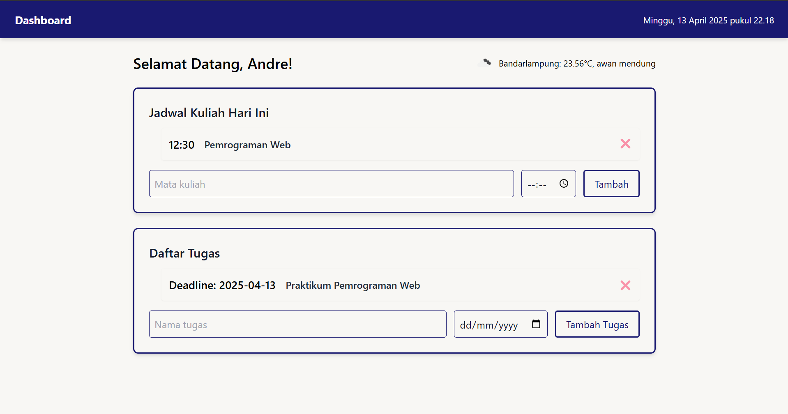

# 📘 Dashboard Mahasiswa

Dashboard Mahasiswa adalah aplikasi berbasis web sederhana yang membantu mahasiswa dalam **mengelola jadwal kuliah dan daftar tugas harian**, dilengkapi dengan **informasi cuaca terkini**. Aplikasi ini dibangun menggunakan **HTML**, **Tailwind CSS**, dan **JavaScript (ES6+)**, serta memanfaatkan **Local Storage** untuk menyimpan data pengguna secara lokal di browser.

## ✨ Fitur Utama

1. **Tampilan Tanggal & Waktu Otomatis**

   - Menampilkan waktu real-time dengan pembaruan setiap detik.

2. **Informasi Cuaca**

   - Menampilkan informasi cuaca terkini berdasarkan koordinat lokasi menggunakan OpenWeather API.

3. **Jadwal Kuliah Hari Ini**

   - Tambahkan mata kuliah beserta waktu kuliah.
   - Simpan otomatis ke Local Storage.
   - Dapat menghapus jadwal.

4. **Daftar Tugas**
   - Tambahkan nama tugas dan deadline.
   - Simpan otomatis ke Local Storage.
   - Dapat menghapus tugas.

---

## 🖼️ Tampilan Aplikasi

> Berikut adalah contoh tampilan dashboard yang telah selesai:

---

## 🛠️ Fitur ES6+ yang Diimplementasikan

✅ **Class**

- `Jadwal` dan `Tugas` dibuat sebagai class untuk struktur data yang lebih rapi.

✅ **Arrow Function**

- Digunakan untuk fungsi seperti `updateTanggalWaktu`, `simpanJadwal`, `loadJadwal`, dll.

✅ **Template Literals**

- Digunakan untuk membangun elemen HTML dengan `innerHTML`.

✅ **Destructuring & Spread**

- Penggunaan spread pada array saat menghapus item dari list.

✅ **Async/Await**

- Digunakan untuk mengambil data cuaca dari API secara asynchronous.

✅ **Default Parameter dan Optional Chaining**

- Digunakan pada beberapa fungsi utilitas untuk menjaga performa dan kestabilan kode.

✅ **Modularisasi Kode**

- Kode dipisahkan dalam file `index.html` dan `script.js` agar lebih mudah dikelola dan dikembangkan.

---

## 📦 Teknologi yang Digunakan

- HTML5
- Tailwind CSS (via CDN)
- JavaScript ES6+
- OpenWeatherMap API
- Local Storage

---

## 🧑‍💻 Cara Menjalankan

1. Clone atau download repository ini.
2. Buka file `index.html` di browser.
3. Aplikasi siap digunakan tanpa instalasi tambahan.

---

## 📍 Lokasi Cuaca

Saat ini cuaca diambil berdasarkan koordinat: Latitude : -5.43 & Longitude: 105.27 yang menunjukkan wilayah sekitar **Bandar Lampung**.

---

## 📝 Lisensi

Proyek ini bersifat open-source dan bebas digunakan untuk pembelajaran.
