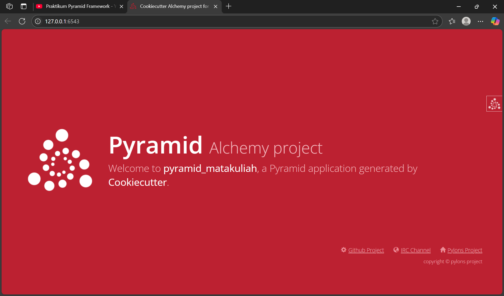
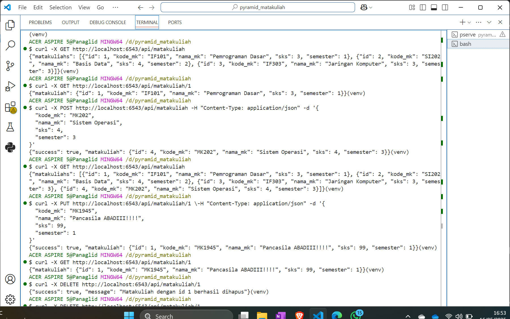
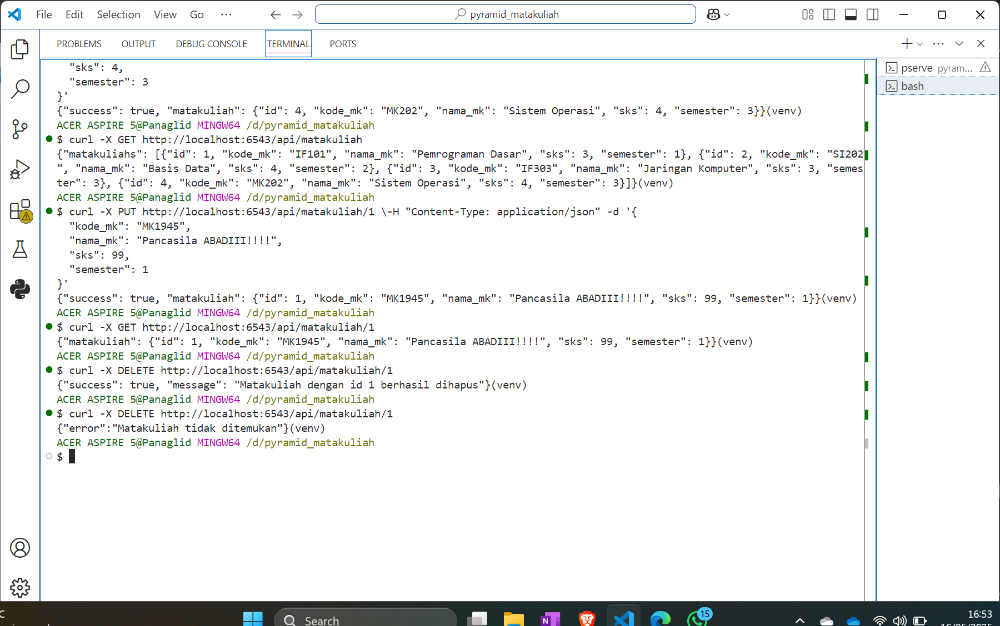

# Pyramid Matakuliah API

Proyek backend sederhana menggunakan [Pyramid](https://trypyramid.com/) untuk manajemen data **Matakuliah** dengan fitur CRUD (Create, Read, Update, Delete).

## Bukti Pengujian

Pyramid Aktif dan Siap Untuk Diuji


Hasil Testing



## Fitur

- Menampilkan daftar matakuliah
- Menampilkan detail matakuliah berdasarkan ID
- Menambahkan matakuliah baru
- Mengupdate data matakuliah
- Menghapus matakuliah

## Teknologi

- Python 3.x
- Pyramid Framework
- SQLAlchemy (ORM)
- PostgreSQL (database)
- Alembic (migrasi database)

## Instalasi

1. Clone repository ini:

   ```bash
   git clone <repository-url>
   cd pyramid_matakuliah

   ```

2. Buat virtual environment dan aktifkan:

   ```bash
   python -m venv venv
   source venv/bin/activate   # Linux/Mac
   venv\Scripts\activate      # Windows

   ```

3. Install dependencies:

   ```bash
   pip install -r requirements.txt

   ```

4. Konfigurasi database PostgreSQL di development.ini
5. Jalankan migrasi dan inisialisasi database:

   ```bash
   python -m pyramid_matakuliah.scripts.initialize_db development.ini

   ```

6. Jalankan aplikasi:

   ```bash
   pserve development.ini --reload
   ```
